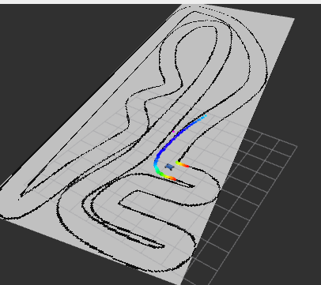

# AI-Based-FTG-Reactive-Controllers
<p align="center">
  
</p>

This repository contains the nominal work found within the paper, ['Neural Process-Based Reactive Controller for Autonomous Racing'](https://www.arxiv.org/abs/2601.12143), where we investigate the efficacy of a neural process-based follow-the-gap racing control law augmented with control-theoretic safety guarantees from a measurement-based control barrier function (CBF) and control-related inductive bias being incorporated via a novel architecture - physics-informed attentive neural process (PI-AttNP). We evaluate all models along with the expert in a simulated F1tenth racing environment, where the simulation and the corresponding installation steps are found in UCF CARVEL Racer repository [here](https://github.com/F1Tenth-UCF/cavrel_racer).

To properly build the ros2 nodes into a custom workspace, we assume the simulation ros2 workspaces ```sim_ws``` and ```racer_ws``` from [here](https://github.com/F1Tenth-UCF/cavrel_racer) are set up prior. Once this step is done, move directories ```np_gap_follower```, ```mlp_gap_follower```, and ```gap_follow``` into your custom workspace with ending ```~/cavrel_racer/racer_ws/src```. From there, the final steps that are required are the following:

<pre>
cd ..  #(Assuming ~/cavrel_racer/racer_ws/src)
colcon build --symlink-install --packages-select np_gap_follower mlp_gap_follower gap_follow
source install/local_setup.bash
</pre>

